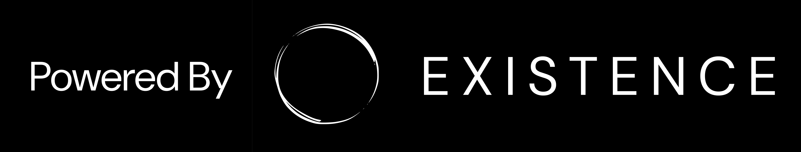

<div align="center">


<h1>Your proactive AI companion</h1>
  
<!-- Badges -->
<p>
  <a href="https://github.com/existence-master/Sentient/graphs/contributors">
    
  </a>
  <a href="">
    
  </a>
  <a href="https://github.com/existence-master/Sentient/network/members">
    
  </a>
  <a href="https://github.com/existence-master/Sentient/stargazers">
    
  </a>
  <a href="https://github.com/existence-master/Sentient/issues/">
    
  </a>
</p>
   
<h4>
    <a href="https://www.youtube.com/watch?v=vIWgxLUlgR8/">View Demo</a>
  <span> · </span>
    <a href="https://sentient-2.gitbook.io/docs">Documentation</a>
  <span> · </span>
    <a href="https://github.com/existence-master/Sentient/issues/">Report Bug</a>
  <span> · </span>
    <a href="https://github.com/existence-master/Sentient/issues/">Request Feature</a>
  <span> · </span>
    <a href="https://www.youtube.com/watch?v=l481bvpCjbc">Watch our Ad!</a>
  </h4>
</div>

<br />

<!-- Table of Contents -->

# :notebook_with_decorative_cover: Table of Contents

- [About The Project](#star2-about-the-project)
  - [Philosophy](#thought_balloon-philosophy)
  - [Screenshots](#camera-screenshots)
  - [Tech Stack](#space_invader-tech-stack)
  - [Features](#dart-features)
- [Roadmap](#compass-roadmap)
- [Getting Started](#toolbox-getting-started)
  - [For Contributors (default branch)](#for-contributors-default-branch)
  - [For Self-Hosting (self-host branch)](#for-self-hosting-self-host-branch)
- [Usage](#eyes-usage)
- [Contributing](#wave-contributing)
  - [Code of Conduct](#scroll-code-of-conduct)
- [FAQ](#grey_question-faq)
- [License](#warning-license)
- [Contact](#handshake-contact)
- [Acknowledgements](#gem-acknowledgements)
- [Official Team](#heavy_check_mark-official-team)

<!-- About The Project -->

## :star2: About The Project

<!-- Philosophy -->

## :thought_balloon: Philosophy

We at [Existence](https://existence.technology) believe that AI won't simply die as a fad or remain limited to an assistant. Instead, it will evolve to be a true companion of humans, and our aim with Sentient is to contribute to that future. Building a true companion requires excellent automation which in turn requires deep personalization. And if we want the AI to be completely context-aware of the user, privacy is non-negotiable. Hence, we aim to build a proactive & interactive AI companion. And we want to build it in the open, not behind closed doors, with transparency as a core pillar.

<!-- Screenshots -->

### :camera: Screenshots

<div align="center"> 
  
  <p align="center">Context is streamed in from your apps - Sentient uses this context to 👇</p>
</div>
<div align="center"> 
  
  <p align="center">Learn Long-Term Memories about you</p>
</div>
<div align="center"> 
  
  <p align="center">Learn Short-Term Memories about you</p>
</div>
<div align="center"> 
  
  <p align="center">Perform Actions for you, asynchronously and by combining all the different tools it needs to complete a task.</p>
</div>
<div align="center"> 
  
  <p align="center">You can also voice-call Sentient anytime for a low-latency, human-like interactive experience.</p>
</div>
<div align="center"> 
  
  <p align="center">Your profile can also be enriched with data from other social media sites.</p>
</div>

<!-- TechStack -->

### :space_invader: Tech Stack

<details>
  <summary>Sentient Desktop App</summary>
  <ul>
    <li><a href="https://www.typescriptlang.org/">ElectronJS</a></li>
    <li><a href="https://nextjs.org/">Next.js</a></li>
    <li><a href="https://tailwindcss.com/">TailwindCSS</a></li>
    <li><a href="https://fastapi.tiangolo.com/">FastAPI</a></li>
    <li><a href="https://ollama.com/">Ollama</a></li>
    <li><a href="https://neo4j.com/">Neo4j</a></li>
    <li><a href="https://praw.readthedocs.io/en/stable/">PRAW Reddit API</a></li>
    <li><a href="https://pypi.org/project/linkedin-scraper/">LinkedIn Scraper</a></li>
    <li><a href="https://nitter-scraper.readthedocs.io/en/latest/">Nitter for X</a></li>
    <li><a href="https://developers.google.com/workspace">Google Workspace APIs</a></li>
    <li><a href="https://brave.com/search/api/">Brave Search API</a></li>
  </ul>
</details>

<!-- Features -->

### :dart: Features

- Proactive - Autonomously pulls context from your connected apps/context streams. It then uses this context to learn about you and perform actions for you.
- Self-hostable, with support for Ollama (for the text model), llamacpp for the voice models and HF-transformers for some other models.
- Full cloud-hosted version coming soon! [Join this group to be a part of the waitlist.](https://chat.whatsapp.com/IOHxuf2W8cKEuyZrMo8DOJ)
- LinkedIn, Reddit and X Integration for enriching personal profiles with even more data.
- Self-Managed Memory - Sentient can learn about the user from their interactions with it. Long-term memories are saved in a knowledge graph, while short-term memories are saved in a relational database.
- Agentic integrations for GSuite - Gmail, GCalendar, GDrive, GDocs, GSheets, GSlides support. Sentient can read context from and perform actions with all these tools. (WIP, some tools are still being expanded)
- Voice Mode - Switch to voice at any time for a smoother, low-latency, human-like interaction with Sentient.
- Web Search capabilities - Sentient can search the web to give users daily briefs, completely autonomously and also for providing additional context to answer queries (if required).
- Uni-chat: Everything happens in one chat - no need to switch between different chats for different topics. (WIP, currently uses the long and short-term memories to maintain context. We will soon introduce even more memory features.)
- Auto-updates for the Electron client ensure that you are always on the latest version.

<!-- Roadmap -->

## :compass: Roadmap

- [x] (WIP) Solving stability issues with model inference - improving structured outputs, better error handling, and more
- [x] Dual Memory - Sentient has a short-term memory and a long-term memory. The short-term memory will be stored in a relational DB and used to maintain reminders and other short-term information. Longer-term facts about the user (such as relationships, preferences, etc) will persist in the knowledge graph.
- [x] (WIP) Intent - Sentient will be able to perform actions autonomously based on triggers from the context pulled from a user's apps and triggers launched by the short-term memories. 
- [x] Memory and Task Queues - Send memory and agent operations to an async queue for being handled separate from the current conversation - improves response time.
- [x] Advanced Voice Mode - Users can talk to Sentient using only their voice.
- [x] (WIP) Better Internet Search - Internet search will include images, citations, direct links to sources and more. 
- [ ] Integrate reasoning models for planning steps when performing actions.
- [ ] Implement multi-user, cloud features with scalability in mind. Migrate to the cloud and go for a full cloud launch.
- [ ] Mobile Companion App - Mobile app will be added to allow users to access Sentient from even more devices. Even more context can be added for Sentient from the phone's push notifications, mic, etc.
- [ ] More tools! - More tools will be added in the order of user requests. Current requests - Microsoft 365, Notion, LinkedIn, GitHub and WhatsApp.
- [ ] Audio Context - adds the microphones on your devices as an additional context stream.
- [ ] Full integration at the OS level - integrate context from what you are doing right now by sharing your screen with Sentient
- [ ] Tool-specific UI - for example, a tool that retrieves stock prices will also show a graph of the past trend of that particular ticker.
- [ ] Browser/Computer Use - Sentient will be able to control a cloud VM to perform general actions for users like downloading, reading and reviewing files and more.
- [ ] Customizable Agentic Actions - users can create their own integrations using an easy-to-use interface. Users should also be able to trade custom Actions on a Marketplace.

<!-- Getting Started -->

## :toolbox: Getting Started

Choose your path below.  
- **Contributors**: Follow along in the **default** branch.  
- **Self-Hosters**: Switch to the **self-host** branch to get the self-hostable version with identical instructions.

---

### For Contributors (default branch)

If you're here to **contribute** to Sentient—adding features, fixing bugs, improving docs—follow these steps on the **default** branch.

1. **Clone the repo**  
   ```bash
   git clone https://github.com/existence-master/Sentient.git
   cd Sentient
   ```

2. **Prerequisites**

   * **Node.js & npm**
     Install from [nodejs.org](https://nodejs.org/en/download).
   * **Python 3.11+**
     Install from [python.org](https://www.python.org/downloads/).
   * **Ollama** (for text models)
     Install from [ollama.com](https://ollama.com/).
   * **Neo4j Community Edition** (for the knowledge graph)
     Download from [neo4j.com](https://neo4j.com/deployment-center/).

3. **Frontend setup**

   ```bash
   cd src/client
   npm install
   ```

4. **Backend setup**

   ```bash
   cd src/server
   python3 -m venv venv
   source venv/bin/activate
   pip install -r requirements.txt
   ```

   > ⚠️ If you encounter numpy errors, first install with the latest numpy (2.x), then downgrade to 1.26.4.

5. **Ollama models**

   ```bash
   ollama pull llama3.2:3b
   ```

   *Tip*: To use another model, update `BASE_MODEL_REPO_ID` in your `.env` accordingly.

6. **Neo4j APOC plugin**

   * Copy `apoc-x.x.x-core.jar` into `neo4j/plugins`.
   * In `neo4j/conf/neo4j.conf`:

     ```ini
     dbms.security.procedures.unrestricted=apoc.*
     dbms.security.procedures.allowlist=apoc.*
     dbms.unmanaged_extension_classes=apoc.export=/apoc
     ```

7. **Environment variables**

   * **Frontend**: create `src/interface/.env`:

     ```env
     ELECTRON_APP_URL="http://localhost:3000"
     APP_SERVER_URL="http://127.0.0.1:5000"
     NEO4J_SERVER_URL="http://localhost:7474"
     BASE_MODEL_REPO_ID="llama3.2:3b"
     AUTH0_DOMAIN="your-auth0-domain"
     AUTH0_CLIENT_ID="your-auth0-client-id"
     ```
   * **Backend**: create `src/server/.env`:

     ```env
     NEO4J_URI=bolt://localhost:7687
     NEO4J_USERNAME=neo4j
     NEO4J_PASSWORD=your-password
     EMBEDDING_MODEL_REPO_ID=sentence-transformers/all-MiniLM-L6-v2
     BASE_MODEL_URL=http://localhost:11434/api/chat
     BASE_MODEL_REPO_ID=llama3.2:3b
     GOOGLE_CLIENT_ID=…
     GOOGLE_CLIENT_SECRET=…
     BRAVE_SUBSCRIPTION_TOKEN=…
     AES_SECRET_KEY=…
     AES_IV=…
     ```

   > ⚠️ If you need example keys, see the discussion “Request Environment Variables” in Issues.

8. **Run everything**

   * Start Neo4j:

     ```bash
     cd neo4j/bin && ./neo4j console
     ```
   * Start backend:

     ```bash
     cd src/server
     source venv/bin/activate
     python -m server.app.app
     ```
   * Start Electron client:

     ```bash
     cd src/client
     npm run dev
     ```

---

### For Self-Hosting (self-host branch)

If you just want to **self-host** Sentient—no contributions needed—switch to the `self-host` branch. The instructions are **identical** to the contributors guide above, but this branch is tailored for self-hosting deployments.

1. **Switch branches**

   ```bash
   git clone https://github.com/existence-master/Sentient.git
   cd Sentient
   git checkout self-host
   ```

2. **Follow all steps** in the **Contributors** section above, starting at “Prerequisites.”

   * Install dependencies
   * Pull Ollama models
   * Configure Neo4j & environment files
   * Run Neo4j, backend, and client

> **Tip**: The `self-host` branch will always mirror the default branch’s setup instructions. Any updates to installation or configuration in the default branch will be back-ported here for self-hosting users.

---

## :eyes: Usage

Sentient is a proactive companion that pulls context from the different apps you use and uses that context to remember new information about you, perform tasks for you like sending emails, creating docs and more. The goal of this personal companion is to take over the mundane tasks in your life to let you focus on what matters.

### Use-Cases:

Sentient can also do a lot based on simple user commands.

* `"Hey Sentient, help me find a restaurant in Pune based on my food preferences.`
* `What are the upcoming events in my Google Calendar?`
* `Setup a lunch meeting with tom@email.com and add it to my Calendar`
* `Create a pitch deck for my startup in Google Slides and email it to tom@email.com`
* `Help me find new hobbies in my city`

📹 [Check out our ad!](https://www.youtube.com/watch?v=Oeqmg25yqDY)

<!-- Contributing -->

## :wave: Contributing

<a href="https://github.com/existence-master/Sentient/graphs/contributors">
  
</a>

Contributions are always welcome!

See the [contributing guide](https://github.com/existence-master/Sentient/blob/master/CONTRIBUTING.md) for ways to get started.

<!-- Code of Conduct -->

### :scroll: Code of Conduct

Please read the [code of conduct](https://github.com/existence-master/Sentient/blob/master/CODE_OF_CONDUCT.md)

<!-- FAQ -->

## :grey_question: FAQ

* **When will the cloud version launch?**
  We are working as fast as we can to bring it to life! Join our [WhatsApp Community](https://chat.whatsapp.com/IOHxuf2W8cKEuyZrMo8DOJ) to get daily updates and more!

* **What data do you collect about me?**
  For auth, we have a standard email–password flow provided by Auth0 (also supports Google OAuth). We only collect your email and login history. Read more in our [privacy policy](https://existence-sentient.vercel.app/privacy).

* **What hardware do I need?**

  * **Text mode**: CPU (Intel i5 or equivalent), 8 GB RAM, GPU with 4–6 GB VRAM.
  * **Voice mode**: Additional VRAM depending on your Orpheus 3B quant.

* **Why open source & AGPL?**
  Transparency around personal data is core to our philosophy. AGPL ensures derivatives also remain open, preventing closed-source forks.

<!-- License -->

## :warning: License

Distributed under the GNU AGPL License. See [LICENSE.txt](https://github.com/existence-master/Sentient/blob/master/LICENSE.txt) for details.

<!-- Contact -->

## :handshake: Contact

[existence.sentient@gmail.com](mailto:existence.sentient@gmail.com)

<!-- Acknowledgments -->

## :gem: Acknowledgements

Sentient wouldn't have been possible without:

* [Ollama](https://ollama.com/)
* [Neo4j](https://neo4j.com/)
* [FastAPI](https://fastapi.tiangolo.com/)
* [Meta's Llama Models](https://www.llama.com/)
* [ElectronJS](https://www.electronjs.org/)
* [Next.js](https://nextjs.org/)

<!-- Official Team -->

## :heavy_check_mark: Official Team

<table>
  <tr>
     <td align="center">
       <a href="https://github.com/itsskofficial">
         
         <br />
         <sub><b>itsskofficial</b></sub>
       </a>
     </td>  
     <td align="center">
       <a href="https://github.com/kabeer2004">
         
         <br />
         <sub><b>kabeer2004</b></sub>
       </a>
     </td>  
     <td align="center">
       <a href="https://github.com/abhijeetsuryawanshi12">
         
         <br />
         <sub><b>abhijeetsuryawanshi12</b></sub>
       </a>
     </td>
  </tr>
</table>
<br />


